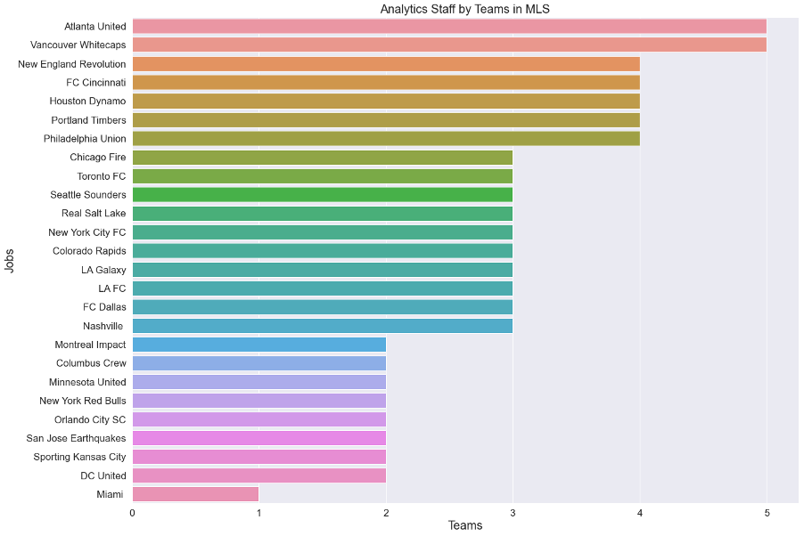
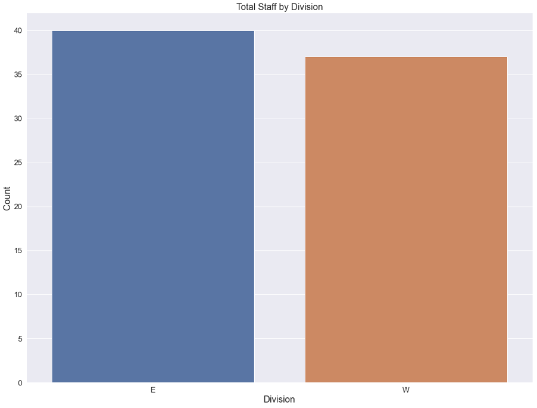
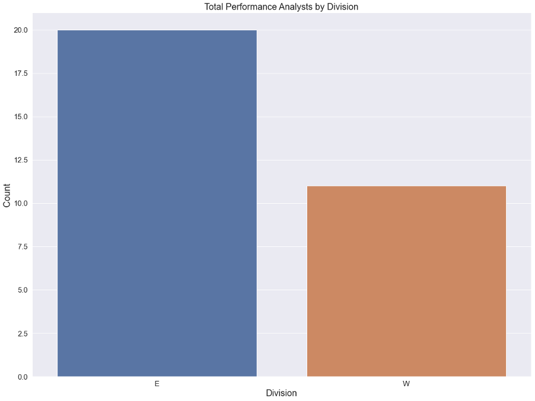

# The Current State of Major League Soccer (MLS) Analytics

<!-- Add buttons here -->

**Project Status: Completed**
 
<a href="https://nbviewer.jupyter.org/github/navido89/DS-Job-Market-Analysis/blob/master/Indeed-DS-Jobs-Final.ipynb?flush_cache=True" target="_blank">Jupyter Notebook Viewer</a>
 
<a href="https://towardsdatascience.com/california-data-science-job-market-analysis-b42d7c82ab00" target="_blank">Read Article</a>

## Table of contents
- [Project Objective](#project-objective)
- [Methods Used](#methods-used)
- [Technologies](#technologies)
- [Project Description](#project-description)
- [Project Results](#project-results)
- [Installation](#installation)

## Project Objective
[(Back to top)](#table-of-contents)
 
The purpose of this project is to examine the current data science job market in California. Which city has the most job posts in CA and offers more opportunities? As a current Data Science Master's student, I wanted to find out which jobs a master's degree holder would be eligible to apply for and what skills are most in-demand.
 

## Methods Used
[(Back to top)](#table-of-contents)
+ Data Collection
+ Data Cleaning
+ Exploratory Data Analysis
+ Data Visualization

## Technologies:
[(Back to top)](#table-of-contents)
+ Python
+ NumPy 
+ Pandas 
+ Matplotlib

## Project Description:
[(Back to top)](#table-of-contents)

+ Collected the data on my own from each club's website and through my contacts within the MLS analytics community. 
+ Cleaned the data by using pandas. 
+ Conducted an exploratory data analysis (EDA) to investigate the current state of analytics in MLS. 

## Project Results:
[(Back to top)](#table-of-contents)
 
+ As of January 14, 2021, Atlanta United and Vancouver Whitecaps have the most employees who use data to some extent in their daily tasks.

+ On average, clubs in the MLS have three employees in the soccer operations department that work with data in some capacity.
+ There is almost an equal spread between data-related employees between both conferences (40 in the East vs. 37 in the West).

+ There are almost twice as many performance analysts in the Eastern Conference than the Western Conference. (20 in the East vs. 11 in the West). Atlanta United and New York City FC lead the race when it comes to the total number of performance analysts per club at the 1st team level. Both have a total of three.

+ Even though most MLS clubs have similar structures on how they incorporate data and analytics into their operational procedure, some teams still do things differently. For example, as mentioned above, San Jose Earthquakes is the only team within the league that entirely relies on their local university partnerships when it comes to analytics. Being in Silicon Valley helps since the amount and talent pool of tech-savvy students’ in the surrounding local universities is high. Even though many MLS clubs have partnerships with local universities, the Earthquakes are the only club that solely don’t have an in-house analytics department.
+ Even though most clubs have full-time performance analysts, there are some clubs where the assistant coach is fully responsible for the video analysis. Again, one example is San Jose with their current head coach Matias Almeyda or Inter Miami who’s video analyst was part of their coaching staff last season.
+ There is a trend of former performance analysts or other data-related positions getting promoted to the assistant general manager or general manager roles. The Montreal Impact, LAFC, Colorado Rapids, to name a few, have general managers or assistant general managers coming from an analytics background.

+ The data that flows through the sports science department is mainly physical data. The purpose is to manage players load throughout training and games with the ultimate goal to improve performance and prevent injuries. The technical and recruitment department includes all three different types of data in their analysis. Coaches incorporate event data and tracking data concerning Opposition analysis, game evaluation, or player development. In addition to that, the technical staff also uses data through their Live-Match analysis. Physical data is mostly used to plan training by the advice from the sports science team. The recruitment department also includes all three data types in their daily work. Event data is mostly used at the beginning stage of identifying a player. For example, if a club is looking for a striker, a particular striker’s goal record is the first statistic one would look at. If a striker hasn’t scored in the last two seasons, for example, you would imagine he wouldn’t be good at doing his job. Once a player has been identified, one would get into more detail and use all three data types in more depth. Back to our striker example, physical data could become handy to see how much distance the striker covers on average. This could potentially help the scout answer the question if the striker works hard off the ball. Tracking data also become in handy when it comes to player comparison. One can compare coordinates with other strikers to see if the movements are similar. Ultimately, each department’s final goal is for the club to gain a competitive advantage over other teams.

## Installation:
[(Back to top)](#table-of-contents)
+ Clone this repo <a href="https://docs.github.com/en/free-pro-team@latest/github/creating-cloning-and-archiving-repositories/cloning-a-repository" target="_blank">(for help see this tutorial).</a>
+ Raw data, data processing/transformation script is being kept in this repo. <a href="https://github.com/navido89/DS-Job-Market-Analysis/blob/master/Indeed-DS-Jobs-Final.ipynb" target="_blank">Click here for notebook.</a>
+ **Note**: If GitHub doesn't load the notebook please refer to <a href="https://nbviewer.jupyter.org/github/navido89/DS-Job-Market-Analysis/blob/master/Indeed-DS-Jobs-Final.ipynb?flush_cache=True" target="_blank">Jupyter Notebook Viewer.</a>
